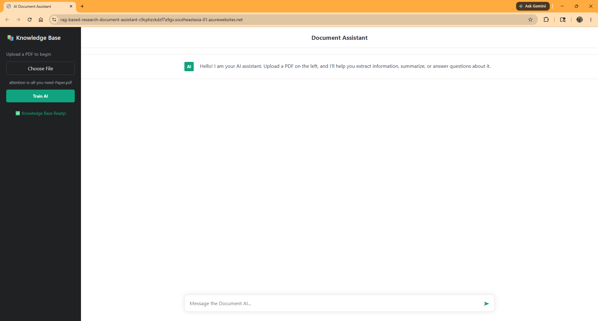
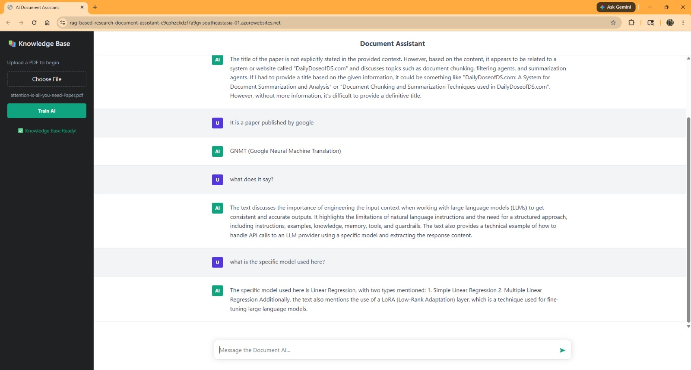
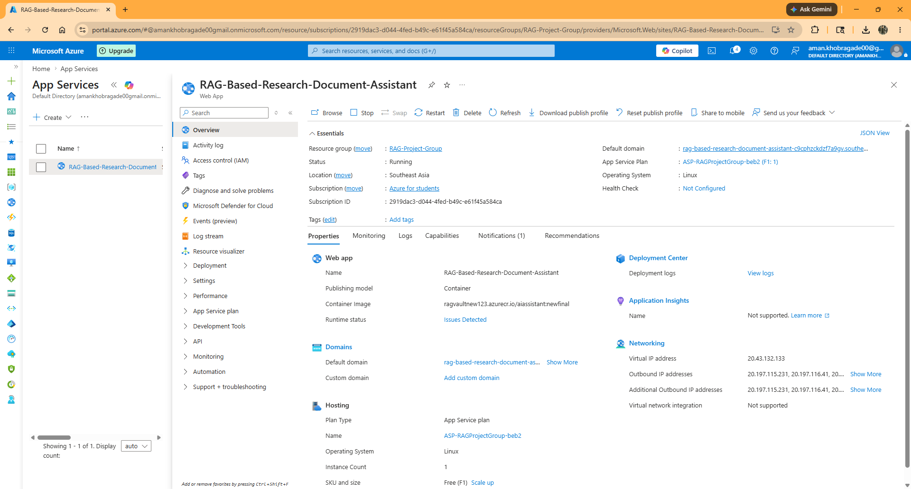
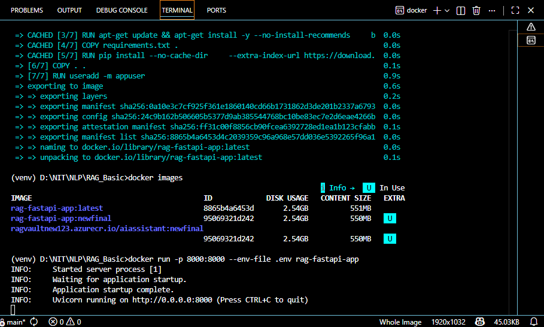

# RAG-Based-Document-Assistant

AI-powered Retrieval-Augmented Generation (RAG) application that allows users to upload PDF documents and interact with them using natural language queries.

Built using FastAPI, LangChain, Pinecone, Groq LLMs, Docker, and deployed on Microsoft Azure.

---

# Live Demo

> Add your Azure deployed URL here

```bash
https://rag-based-research-document-assistant-c9cphzckdzf7a9gv.southeastasia-01.azurewebsites.net/
```

---

# Features

* Upload PDF documents
* Intelligent document chunking
* Semantic vector embeddings
* Pinecone vector database integration
* Retrieval-Augmented Generation (RAG)
* Conversational AI question answering
* FastAPI backend
* Interactive frontend UI
* Dockerized deployment
* Azure App Service deployment
* Groq LLM integration
* Secure environment variable handling

---

# Tech Stack

## Backend

* FastAPI
* Python

## AI / LLM

* LangChain
* Groq (Llama 3.3 70B Versatile)

## Vector Database

* Pinecone

## Embeddings

* HuggingFace Sentence Transformers

## Frontend

* HTML
* CSS
* JavaScript

## Deployment

* Docker
* Microsoft Azure App Service

---

# Project Architecture

```text
User Uploads PDF
        │
        ▼
PDF Loader (PyPDFLoader)
        │
        ▼
Text Chunking
        │
        ▼
Embeddings Generation
        │
        ▼
Pinecone Vector Database
        │
        ▼
Retriever
        │
        ▼
Groq LLM
        │
        ▼
AI Generated Answer
```

---

# Folder Structure

```bash
RAG_Basic/
│
├── static/
│   ├── style.css
│   └── javascript.js
│
├── app.py
├── main.py
├── chunking.py
├── embedding.py
├── data_ingestion.py
├── Dockerfile
├── requirements.txt
├── index.html
├── .dockerignore
├── .gitignore
└── .env.example
```

---

# Environment Variables

Create a `.env` file in the project root.

```env
PINECONE_API_KEY=your_pinecone_api_key
GROQ_API_KEY=your_groq_api_key
HF_TOKEN=your_huggingface_token
```

---

# Installation

## Clone Repository

```bash
git clone https://github.com/PeaceLoveInfinity/Rag-Based-Document-Assistant.git
```

```bash
cd Rag-Based-Document-Assistant
```

---

# Create Virtual Environment

```bash
python -m venv venv
```

## Activate Environment

### Windows

```bash
venv\Scripts\activate
```

### Linux / Mac

```bash
source venv/bin/activate
```

---

# Install Dependencies

```bash
pip install -r requirements.txt
```

---

# Run Locally

```bash
uvicorn app:app --reload
```

Application will run at:

```bash
http://127.0.0.1:8000
```

---

# Docker Deployment

## Build Docker Image

```bash
docker build -t rag-fastapi-app .
```

## Run Docker Container

```bash
docker run --env-file .env -p 8000:8000 rag-fastapi-app
```

---

# Azure Deployment

## Steps

1. Create Azure Container Registry (ACR)
2. Build Docker image locally
3. Push Docker image to ACR
4. Create Azure App Service
5. Configure environment variables
6. Deploy container image
7. Enable logging and monitoring

---

# API Endpoints

## Upload PDF

```http
POST /upload
```

## Ask Questions

```http
POST /ask
```

---

# Screenshots

## Home Interface

> Add screenshot here

```markdown

```

## Upload PDF

```markdown

```

## Question Answering

```markdown

```

## Azure Deployment

```markdown

```

## Docker

```markdown

```

---

# Security Best Practices

* `.env` excluded using `.gitignore`
* API keys protected
* Dockerized isolated environment
* Non-root Docker user
* Environment variable-based configuration

---

# Future Improvements

* Multi-document support
* Chat history memory
* Authentication system
* Streaming responses
* Hybrid search
* Citation-based answers
* PDF summarization
* Voice input support
* Multi-user sessions
* Kubernetes deployment

---

# Learning Outcomes

Through this project, I learned:

* Retrieval-Augmented Generation (RAG)
* Vector databases and embeddings
* LangChain pipelines
* FastAPI backend development
* Docker containerization
* Azure cloud deployment
* LLM integration using Groq
* Production deployment debugging

---

# License

This project is licensed under the MIT License.

---

# Author

Aman Khobragade

GitHub:
https://github.com/PeaceLoveInfinity

```
```
